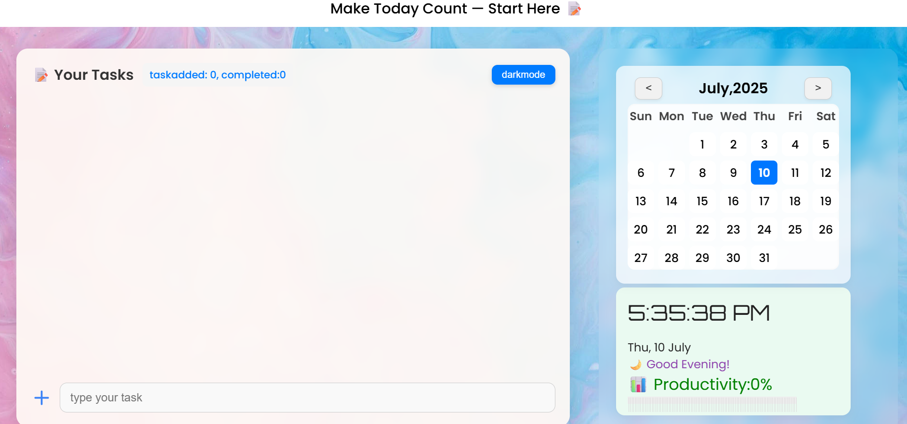

# ✅ To-Do Productivity App

A sleek and responsive To-Do list application built using **HTML**, **CSS**, and **JavaScript**, with task persistence using **localStorage**. Designed to help you stay organized and focused throughout your day.

## 🚀 Features

- ✍️ Add and remove tasks  
- ✅ Mark tasks as complete  
- ♻️ Automatically saves tasks using `localStorage`  
- 📅 Built-in calendar view  
- 🌓 Dark mode toggle  
- ⏰ Live clock and date section  
- 📊 Productivity meter  
- 📱 Responsive layout (optimized for desktop view)

## 🌐 Live Demo

👉 [Try it Live](https://todo-productivity-app.vercel.app/)

## 🛠️ Tech Stack

- **Frontend**: HTML, CSS, JavaScript  
- **Storage**: localStorage (client-side)

## 📦 Installation & Usage (Local)

1. **Clone the repository:**
    ```bash
    git clone https://github.com/harshwardhan-d/todo-productivity-app.git
    cd todo-productivity-app
    ```

2. **Open `index.html` in your browser**  
   No server or backend setup required — just open the file directly.

## 📁 Folder Structure

```
todo-productivity-app/
├── index.html        # Main HTML page
├── style.css         # CSS styles
├── script.js         # JavaScript functionality
├── todoUi.png        # UI Screenshot
└── README.md         # Project documentation
```

## 📸 Screenshot



> 💡 *This layout is fully responsive but looks best on desktops due to the calendar and clock section.*

## 💡 Future Improvements

- 🔔 Add task notifications/reminders  
- 🗂️ Tag and categorize tasks  
- 📊 Analytics for weekly/monthly productivity  
- ☁️ Sync with cloud storage or user account system

---

## 🧑‍💻 Author

Made with ❤️ by [Harshwardhan Dhaneliya](https://github.com/harshwardhan-d)  
🔗 [Connect on LinkedIn](https://www.linkedin.com/in/harshwardhan-dhaneliya-8642b4326/)
